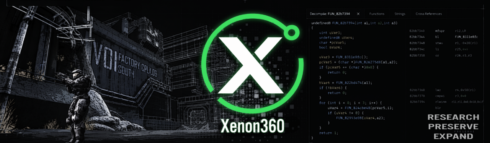

<p align="center">
  
</p>

# Xenon360

Xenon360 is a **Ghidra 12.1.4** extension for Xbox 360 executable analysis.

**Current release:** Xenon360 v0.7.0

**Supported Ghidra version:** 12.1.4

Xenon360 is an independent open-source project. It is not affiliated with, sponsored by, or endorsed by Microsoft. Xbox and Xbox 360 are trademarks of Microsoft.

## Features

- XEX0, XEX?, XEX%, XEX-, XEX1, XEX2, and XEXP/DELTA loading
- NONE, BASIC, and NORMAL/LZX image reconstruction
- Supported retail and development encryption paths
- Xenon PowerPC/VMX128 language support
- Import naming for common Xbox 360 system modules
- Native PDB/XDB symbol loading through Ghidra's Universal PDB support
- Automatic compiler-helper modeling before normal Auto Analysis
- One extension package for Windows, Linux, and macOS

## Install

Xenon360 v0.7.0 currently targets **Ghidra 12.1.4**. Other Ghidra versions have not been packaged or validated.

1. Download `ghidra_12.1.4_XenonVMX128_0.7.0.zip` from the v0.7.0 release.
2. In Ghidra 12.1.4, open **File > Install Extensions**.
3. Click **+** and select the Xenon360 ZIP.
4. Restart Ghidra.
5. Import an Xbox 360 executable with **Xenon360 XEX** and run normal Auto Analysis.

For XEXP patches, choose the matching source executable with the **Base XEX** picker. For native symbols, use the **PDB/XDB** picker. The default `public-symbols` mode loads types and public symbols; `all` enables Ghidra's full Universal PDB analysis.

## Analysis

The Xenon language ID is:

```text
PowerPC:BE:64:Xenon-VMX128-32addr
```

The Ghidra module remains named `XenonVMX128` to preserve existing project bindings.

Unknown imports retain deterministic module-and-ordinal names. Conflicting legacy ordinal observations are left unnamed rather than assigned a guessed export. Native symbol loading checks GUID, age, processor identity, and file integrity before application.

## macOS

Xenon360 uses the same extension ZIP on all supported host platforms.

Ghidra 12.1.4 does not include all required native components in its macOS distribution. Build the Ghidra native components once using Ghidra's **Getting Started > Building Native Components** instructions before using Xenon360 on macOS.

## Build from source

Source builds currently target **Ghidra 12.1.4** and require JDK 21 or newer.

Windows:

```bat
.\gradlew.bat "-PGHIDRA_INSTALL_DIR=C:\Tools\ghidra_12.1.4_PUBLIC" buildExtension
```

Linux and macOS:

```sh
./gradlew -PGHIDRA_INSTALL_DIR=/path/to/ghidra_12.1.4_PUBLIC buildExtension
```

`GHIDRA_INSTALL_DIR` may also be set as an environment variable. The build runs the parser, patch, import-name, and language checks and produces:

```text
dist/ghidra_12.1.4_XenonVMX128_0.7.0.zip
```

with a matching SHA-256 checksum file.

## Tests

The build includes standalone regression tests plus a synthetic XEX smoke test that exercises import, Auto Analysis, compiler-helper modeling, VMX128 decoding, and native decompilation.

Run the full smoke test with:

```sh
./gradlew -PGHIDRA_INSTALL_DIR=/path/to/ghidra_12.1.4_PUBLIC buildExtension smokeTest
```

Use `gradlew.bat` on Windows.

## Source handling

Xenon360 does not execute game code or modify source executables. XEXP patches are reconstructed in memory.

The repository and release package do not include game executables, game code, game symbols, Xbox SDK files, or other proprietary runtime content. Users supply their own XEX/XEXP files and, when available, their own PDB/XDB symbol files.

Signature and hash checks are recorded as diagnostics. Older integrity schemes are not treated as modern XEX2 validation.

Third-party notices are in [THIRD_PARTY_NOTICES.md](THIRD_PARTY_NOTICES.md), with license texts under [licenses](licenses/).

## License

Copyright 2026 EveryoneEverybody.

Xenon360 is licensed under the Apache License 2.0. See [LICENSE](LICENSE). Third-party components and derived material remain under their original licenses as listed in [THIRD_PARTY_NOTICES.md](THIRD_PARTY_NOTICES.md).
